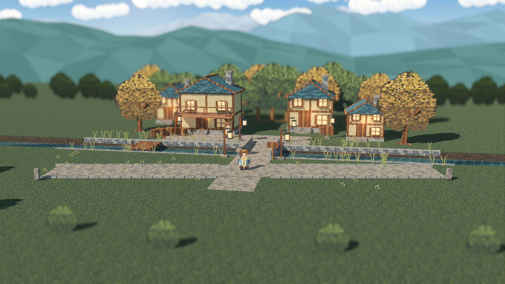

# HD-2D · Riverside Waystation

原创河畔驿站：**三维场景 × 二维像素角色 × 三时段远山天空 × 双端景深**。这是可交互、可重建的技术与视觉样板，不是《八方旅人》的素材移植，也不是完整 RPG。



## 立即预览

在包含 `project.godot` 的目录执行：

```bash
make run       # 运行场景；需要已有图形桌面
make editor    # 打开 Godot；F5 运行
make test      # 素材、来源链、文档和无图形功能测试
make visual    # 1920×1080 真 GPU 图像、功能、5种配置各30秒计时
```

独立 Linux 包解压后执行 `./waystation.x86_64`；不需要安装 Godot 或 Blender。若解压工具未保留执行位，执行 `chmod +x waystation.x86_64`。需要支持 Forward+ 的显卡与 Vulkan 驱动，其他系统未验收。

## 操作

WASD/方向键行走，E 调查或关闭对话，T 切换晴昼/黄昏/夜晚（1/2/3 选择黄昏/夜晚/晴昼），F2 展示模式，F3 后处理对照，F4 有限跟随（默认开），F5 景深，F6 调参面板，F7 远景对照，Tab/H 隐藏界面，F12 截图，Esc 关闭对话或退出。

截图保存到 Godot 的本应用 `user://captures/`，保存后的实际路径会打印到终端。展示模式禁用角色行走；隐藏 HUD 不暂停模拟。

## 文档入口

[Plan：目标与阶段](Plan/README.md) · [ADR：决策及代价](ADR/README.md) · [domain-model：领域模型](domain-model/README.md) · [完整文档索引](docs/README.md)

## 可复现与交付

```bash
make rebuild   # Pillow 原创素材 → Blender → GLB 导入 → 静态场景烘焙
make docs      # 同一份图结构生成 Mermaid 与 SVG，无额外依赖
make reproduce # 干净副本重建，保留独立日志和报告
make templates # 校验已有模板；缺失时下载锁定的官方版本（约 1.28 GB）
make export    # build/linux/waystation.x86_64
make verify-release # 独立二进制功能、GPU与图像验证
make reproduce-visual # 干净副本重建并实际渲染
make record    # 24秒往返视频，输出到 build/p6p7/media/
make package   # build/delivery/p6p7/ 中的新交付与校验和
```

运行只需要 Godot；重建需要 Blender、Python 与 Pillow。实际测试版本保存在 `dependencies.lock.json`，不会自动升级宿主软件。正式打包前阅读[交付指南](docs/delivery/README.md)；测试与限制见[验收报告](docs/validation/baseline-report.md)。

## 当前边界

当前美术为本项目程序化原创基线，保留 17 张源 PNG、12 套 Blender 模型、生成器、散列和可编辑静态场景。**ImageGen 与 Blender MCP 尚未接入**；MCP 高风险执行入口仍须另行批准。没有从原作提取美术。

已经实现行走、碰撞、桥梁通行、NPC/招牌、原子灯光切换、水面动画、景深、泛光、雾与截图。没有战斗、背包、任务、室内地图、音频、真实水面倒影或 Web/Windows 已验收版本。

工程测试通过不等于用户已经批准美术风格。镜头、场景边缘、植被形态和角色细节仍可在本基线上进一步精修；[设计要点与后续方向](docs/design/README.md)明确区分已实现和候选增强。

不自动提交、推送或上传文件。项目代码与原创美术的公开发布许可证由项目所有者决定；引擎及第三方声明见[来源与许可](NOTICE.md)。

## P6/P7 新增玩法
从出生点经石桥向南走，进入30m横向步道，再左右完整往返。默认跟随即可看到近、中、超远山的不同位移，无需进入展示模式。
F5只切换景深；F6提供三档、单端开关、范围、过渡与焦点模式。F3或时段切换不会重置景深选择。
详见[验收与限制](docs/validation/p6p7/README.md)、[构图设计](docs/design/open-exploration.md)、[领域扩展](domain-model/background-and-focus.md)。
旧P0–P5截图保留，不作为新增功能的验收证据。首次打包前请先完成 `make record`。
