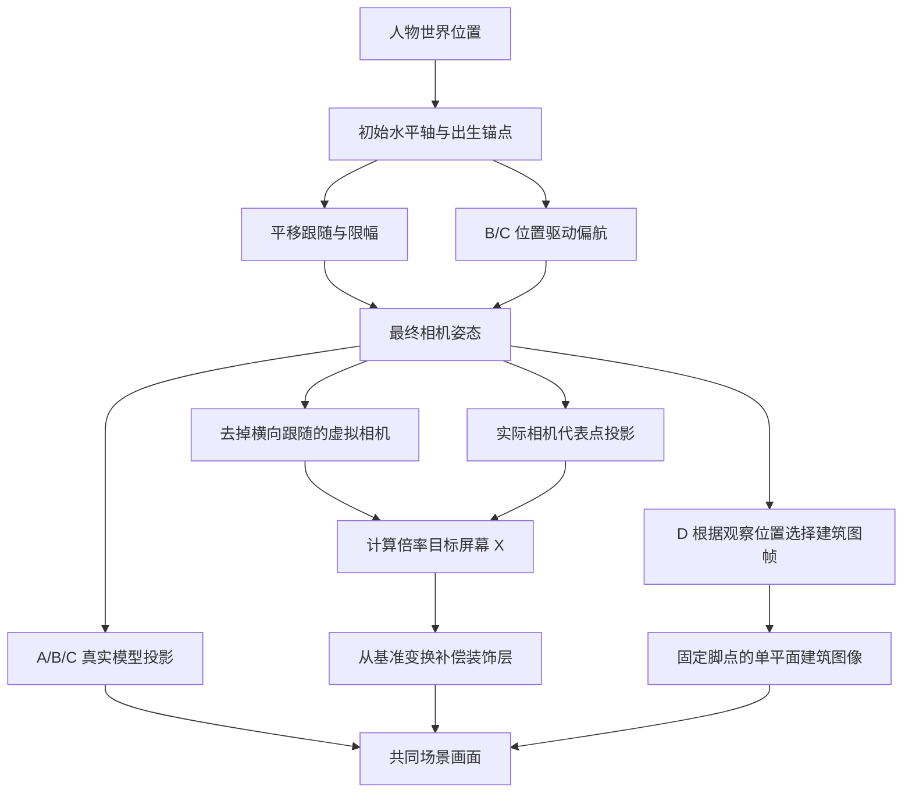

# P9 · 四种观察机制与审阅操作

建筑需要有真实厚度，透视相机从不同位置观察它时，才能逐渐露出不同侧面。镜头的朝向可以保持固定；只要相机跟随人物平移，观察建筑的射线方向就会改变。若相机完全不动，只有人物在画面中走动，静止建筑不会因此改变侧面。

透视投影还会让远处物体变小。正交投影的物体大小不随距离变化，固定朝向的正交相机平移也不会改变建筑观察方向。因此正交方案需要镜头绕转或显式换图才能展示侧面变化。这是通用三维投影关系，不是对《八方旅人》内部代码的结论。[Godot Camera3D 官方说明](https://docs.godotengine.org/en/stable/classes/class_camera3d.html)

## 四种实现看什么

| 模式 | 运行机制 | 审阅重点 |
|---|---|---|
| A | 35°透视，镜头平移，朝向固定 | 不加绕转时，真实视点变化能产生多强的立体感 |
| B | A加位置驱动的±6°水平绕转 | 侧面变化是否更清楚，镜头运动和遮挡是否舒适 |
| C | 正交镜头加±6°水平绕转 | 像素场景更平面时，真实转角是否仍有价值 |
| D | 固定正交镜头，背景分层移动，主建筑使用七个观察图像 | 图集模拟能否成立，换帧痕迹与单平面遮挡是否可接受 |

A/B/C共享模型、材质、碰撞和灯光。D的图片也从同一个Palazzo模型渲染，三时段各一张七视图图集。D只替换Palazzo显示；楼梯、桥、道路和建筑碰撞仍在原位。

轻微绕转不保证能看见每栋建筑的左右两面。是否跨过正面取决于相机的初始方位、建筑朝向与可走路径。当前C的水平观察方位约为21.3°至33.3°，而主建筑正面朝向0°，因此它主要改变同一侧墙的可见宽度。这是保留C作比较的限制，不能把左、右路线截图自动当作已经跨到左右两侧的证明。

## 从人物位置到画面的流程

偏航使用人物相对出生点的横向位移，前1m不绕转，再走10m达到±6°，平滑响应为2.5/s。人物朝向不驱动相机。平移跟随使用固定初始轴，人物手动控制则始终按最终相机屏幕方向映射；二者分开，避免绕转让跟随产生反馈。

人物使用始终朝向镜头的Sprite3D，中央比例按其实际朝向镜头的上下端点标定。64px帧高乘0.035m像素尺寸为2.24m；30px画布偏移沿相机上方向，只有精灵原点的0.04m偏移沿世界上方向。验收不能用人物脚点加世界竖直2.18m来代替精灵高度，否则会把透视缩短误认为正交比例错误。

视差只补偿相机的横向跟随。每层固定一个代表点，比较实际相机与去掉横向跟随后的虚拟相机，再按倍率决定屏幕X位置。倍率1保持原世界位置；倍率0抵消代表点的跟随横移，但不抵消绕转、上下层运动或云风。透视与正交分别使用相应投影公式。代表点是精确目标，厚背景层的其他点仍可能有近似误差，报告会另列边界采样。

D图集包含−24°至+24°的七个图像，实际路线只使用观察位置能触及的区间，不强行按人物走路进度播放全部帧。相邻图像用像素抖动选择，不叠加两层半透明轮廓。所有帧的脚点固定在画布的 `UV=(0.5, 0.8)`，运行贴片按同一脚点定位；它仍只有一个深度平面，不具备真实体积遮挡和建筑投影阴影。

## 审阅操作

从独立P9场景或四方案Linux包启动，默认进入A。先保持同一时段与景深参数，走一遍主桥至左右延伸，再比较其他模式。也可从F9启动共同路线，所有方案都从同一出生点按相同速度实际行走。

| 操作 | 效果 |
|---|---|
| WASD / 方向键 | 按当前屏幕方向行走 |
| F9 | 选择A/B/C/D，查看投影、偏航、视差设置和D图帧 |
| F9内 Reset this variant | 只恢复当前方案的相机与视差默认值 |
| F9内 Run the same walking route | 归位后执行共同桥梁、延伸、平台、码头路线 |
| F8 | 修改当前方案的视差、跟随、风，并显式保存或载入本机设置 |
| F8内 Start camera comparison | 人物停在原地，冻结云/水，用临时镜头移动比较视差 |
| F6 / F5 | 调节景深 / 切换景深开关 |
| T，或1/2/3 | 循环时段，或直接选择黄昏/夜晚/晴昼 |
| E | 调查招牌或与范围内NPC交互 |
| Esc | 停止临时镜头比较，关闭面板/对话；无这些状态时退出 |

先看关闭景深、冻结动态的机制对照，再看三时段完整画面。按实际路线和相同观察位置比较，不根据某一张更好看的截图直接选方案。D图集缺失时界面会阻止进入D并显示原因，不会以三维Palazzo代替图集却仍标为D。

## 状态恢复与证据边界

切换方案保留人物位置、时段、景深选择和碰撞，恢复目标方案自己的视差参数，然后按当前位置重建相机平滑状态。临时预览保存相机变换、跟随位移、当前/目标偏航，以及D当前/目标观察角、图帧和贴片变换。停止预览时一起恢复，避免镜头回位后建筑图帧仍从预览角继续变化。

数学与状态检查保留在 `tests/p9/experiment_camera_unit.gd`。它能检查投影和恢复契约，不能证明美术质量、正交景深效果或性能。实际画面、路线、图形标记、12组性能样本和干净重建结果写入 `build/p9-experiments/`；最终结论以本轮验收报告为准。

[执行计划](../../Plan/features/p9-four-experiments.md) · [ADR-19](../../ADR/19-reference-camera-experiments.md) · [领域契约](../../domain-model/reference-experiments.md)
