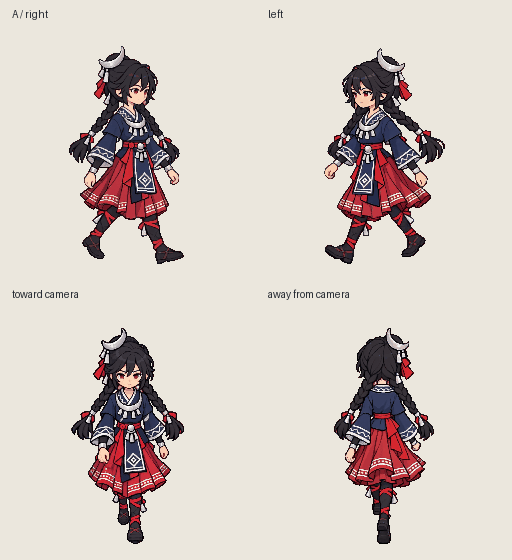
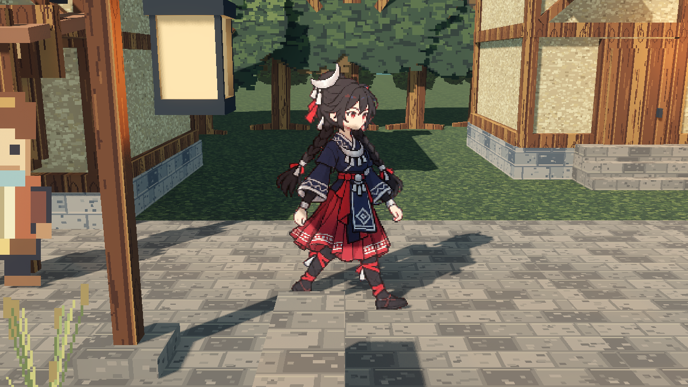

# 默认角色接入 · 2026-10-06

已将用户选定的 A 稿接入默认玩家角色，并补齐朝镜头、背向镜头和三分之四向左行走。驿站、参考场景、灰盒及正面运河四入口共用此角色。斜向移动沿用镜头主方向选择；停止时保留朝向，静止在支撑姿态。

四方向均为原生 256×256、27 帧、1125 ms；每帧保留原始 41/42 ms 时长。右向 A 的 27 张 PNG 与采用来源逐文件字节一致。新增方向使用独立方向母图与 H3 生成，保持饰品的步态摆动、裙摆褶裥延迟及双辫轻微跟随；背面正确隐藏正面胸饰、腰扣与围裙。每方向使用最多 96 色共享色板、固定裁剪、最近邻采样和关闭 mipmap，没有跳帧、插帧或逐帧重新居中。

[采用决定](../../../ADR/20-default-character.md) · [参考、配方、源视频与可编辑 Aseprite](../../../art_source/characters/crescent-traveler/v1/README.md) · [来源与运行资源散列](../../../art_source/characters/crescent-traveler/v1/manifest.json)

## 结果

| 检查 | 结果 |
| --- | --- |
| `make test` | 通过：P8 的 410 项检查、设置跨进程恢复，以及新角色 401 项检查；四方向 PNG/图集逐像素与时序核对通过 |
| `make p9-test` | 通过：575 项素材检查及参考场景物理路线、楼梯、功能测试 |
| `make frontal-test` | 通过：2115 项相机、10430 项镜距/投影检查及正面运河物理路线 |
| 四方向 Aseprite 回读 | 全部 27 帧 RGBA 与毫秒时长精确一致 |
| 实际 GPU | NVIDIA GeForce RTX 4070 SUPER，Forward+；四入口默认图与四方向近景的角色可见像素检查通过 |
| 后台捕获 | 主窗口最小化、不获取焦点，独立 SubViewport 离屏渲染；完成后自动退出，无键盘注入 |
| 独立资源包 | 隔离目录仅含 PCK 与检查脚本，成功加载四方向 JSON、图集及所有原生帧，无外部仓库依赖 |
| 临时服务 | 生成服务与管理器均正常停止，占用已释放，没有遗留所属进程 |

机器可读结果：[测试汇总](test-summary.json)、[原像素检查](pixel-check.json)、[角色运行检查](character-test.json)、[实际 GPU 渲染](render-report.json)、[录像规格与散列](video-report.json)。原 P0–P9 素材与验收证据保留；共享角色脚本的授权采用检查点另行关联 ADR-20，历史散列未删除。

## 预览





[实际场景录像](four-directions-in-scene.mp4)：1280×720、24 fps、13.5 秒，顺序为朝镜头、背向镜头、向左、向右，每个方向三个循环。录像逐帧采样原时序的中点后编码；近景仅调整证据机位并关闭景深模糊，场景灯光、材质和 Sprite3D 受光保留。此录像展示原地步态和细节，物理移动由独立路线检查验证，不用作性能基准。

四入口默认机位：[驿站](waystation-default.png)、[参考场景](reference_scene-default.png)、[灰盒](reference_scene_graybox-default.png)、[正面运河](frontal_canal-default.png)。其他近景：[朝镜头](down-close.png)、[背向镜头](up-close.png)、[向左](left-close.png)。

后台渲染复核可使用已安装引擎：

```sh
godot --path . --display-driver x11 --position 10000,10000 --audio-driver Dummy --disable-render-loop --script res://tools/capture_character.gd -- --ignore-user-settings --character-record
```

输出在 `build/character-directions/render`。本次驱动用户态与已加载内核版本不同，使用项目 build 内的匹配临时库完成验证，没有更换系统驱动、引擎或项目渲染器。无需为本次接入重启系统。

## 来源与边界

背向首稿因中途转成正面而淘汰，源视频与原因保存于来源目录。替换稿的 56 张源帧正确，但服务导出阶段的视频工具发生库冲突；原始失败回执保留，随后使用相同 ToonOut CUDA 配方恢复后处理，源帧散列完全一致，没有重提 H3 或改变抠图方法。128/256 两套完整 56 帧产物均通过尺寸、非空遮罩、二值 alpha 和透明 RGB 归零检查。

没有独立生成待机循环或八方向素材；生成动画的细纹和发梢仍有少量帧间变化。A 的用户采用与新增方向的技术/Agent 运动审阅分别记录，不冒称新增方向已获用户逐帧美术批准。本轮按用户要求提交到本地 Git，未推送或发布。
