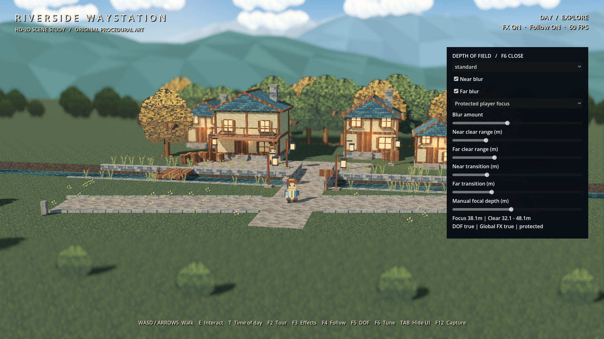
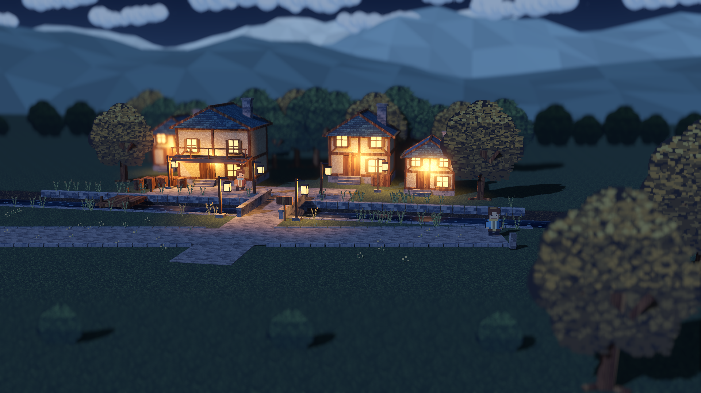
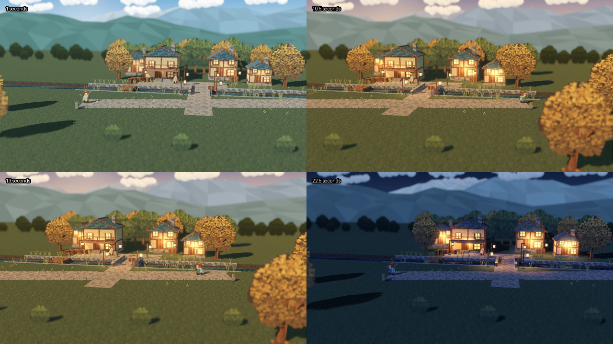

# P6/P7 验收与可复现证据

日期：2026-09-28。状态：工程验收通过；最终美术批准仍由项目所有者决定。
环境：Godot 4.7.2、Forward+、RTX 4070 SUPER、Fedora 43。GPU 检查实际视口1920×1080。
原 P0–P5 截图和验收记录保留，本目录为独立的新基线。

## 结果
| 项目 | 实际结果 |
|---|---|
| 静态检查 | 79项基础与39项新增特性检查通过 |
| 功能、路线、焦点、控制面板、视差契约 | 91项 headless 断言通过，包含原22项回归 |
| 源码真实 GPU | 126项断言通过，含截图与5种条件的持续性能检查 |
| 像素校准 | 38项通过；近远选择性失焦，焦内像素不变 |
| 独立可执行包 | 仅复制嵌入PCK的二进制到独立目录，91项headless、116项GPU与38项图像检查通过 |
| 干净重建 | 9步通过：两组图像、两组Blender模型、导入、烘焙、原测试、新测试、新GPU检查 |
| Blender源文件回读 | 4套新增源模型全部通过，顶点数一致，无外部未打包图像 |
| 视频 | 原生MovieWriter录制720帧，24秒、30FPS，实际MP4为1280×720，完整左右往返 |

[完整GPU报告及原始帧序列](features-report.json) · [图像量化](image-report.json) · [运行文件指纹](runtime-files.json)
[独立包结果](standalone-report.json) · [干净重建结果](reproduction-report.json) · [Blender回读](blender-readback.json)

## 路线与视差
从出生点经石桥步行抵达南岸，30m×3.2m步道两向完整走通。7个等距附近采样点均保持人物在屏幕及清晰区内。
实测相机横向总行程12.214m，朝向保持不变。原6–10m是规划候选；定稿允许6–14m以适配30m步道。
固定相机朝向，沿相机水平轴平移2m，三层网格中心投影位移：

| 层级 | 相机深度 | 屏幕水平位移 |
|---|---:|---:|
| 近山 | 146.372m | -23.4015px |
| 中山 | 332.179m | -10.3116px |
| 超远山 | 814.729m | -4.2041px |

这些是 Godot 对固定网格中心的投影测量，与解析公式比较，不是图像特征跟踪。
相机返回原位无累积漂移；冻结云无移动，单独推进风时间则云动而相机不动。
可见固体射线检查排除纯移动边界墙；植被卡片另经左右端和中央截图、视频复查。

## 景深像素证明
三个同屏幕尺寸的棋盘分别位于相机深度20m、42m、100m，焦点42m。
近／远焦外边缘能量从约41.25降至5.86；只开对侧景深时该区像素不变；焦内区域四种状态像素一致。
这证明原生选择性景深在真实GPU生效，不等于全部游戏美术已经获得批准。

## 持续性能
每种条件实际采样至少30秒，关闭VSync，固定机位和动态时间，场景模拟固定步长60FPS。
表中帧间隔是 frame_post_draw 的真实墙钟间隔，GPU列为引擎视口GPU计时；不是模拟delta，也不是输入到屏幕的延迟。

| 条件 | 样本数 | 帧间隔 P95 | GPU P95 |
|---|---:|---:|---:|
| 背景关闭、景深关闭 | 29,743 | 1.504ms | 0.891ms |
| 背景开启、景深关闭 | 28,775 | 1.538ms | 0.926ms |
| 背景＋标准景深 | 18,792 | 2.037ms | 1.904ms |
| 背景＋强景深 | 18,430 | 2.107ms | 1.922ms |
| 夜晚＋标准景深 | 18,493 | 2.085ms | 1.911ms |

这5个固定条件均满足60FPS帧预算；不代表所有显卡、长时间运行或任何未来场景都达到同等性能。
MovieWriter录制速度不参与上述结论。独立包和干净副本重复功能与图像检查，不重复150秒完整性能采样。

## 图像与录像
目录 `captures/` 保留18张左／中／右、三时段、景深开关实拍，6张中心单端图，以及4张棋盘图。

视频不是 ImageGen 生成动画，而是 Godot 中真实角色碰撞移动与相机跟随的确定性录制。

## 复验与发布
依次执行：`make test`、`make visual`、`make export`、`make verify-release`、`make reproduce-visual`、`make record`、`make package`。
无需再次安装 Godot、Blender 或插件。缺失模板时显式执行 `make templates`，只处理锁定官方版本。
`make features-quick` 跳过持续性能采样，不能代替正式发布所需的 `make visual`。
发布工具核对源码运行指纹、GPU报告、二进制散列、独立运行、重建和视频，旧结果不能满足新代码的发布门禁。
交付在 `build/delivery/p6p7/`，包含源码ZIP、Linux ZIP、视频及SHA256SUMS，旧交付目录保留。

## 设计复查与已知限制
按Plan与实现双线复查：默认探索见天见山、步道双向走通、真实相机平移、独立云风、三时段、单端景深、状态恢复和文档索引均有对应代码与证据。
修复了步道碰撞高差，改为与地面齐平；确认纯移动边界的射线假阳性后分类排除，没有删除物理边界或关闭角色深度测试。
环境使用mipmap，角色图集显式保持无mipmap和无VRAM自动压缩。原始14张素材内容散列没有改变。
云与山体仍是程序化基线；远山多面形态、云样式重复、大片草地细节可继续精修，不宣称与原作完全等价。
调参不自动保存，视口与发布平台只验收桌面Linux；无音频、体积云、真实水面倒影或背景物理系统。
Blender MCP 与 ImageGen 未接入，不影响已验证的Blender CLI与原创程序化素材流程；未安装额外高风险依赖。
