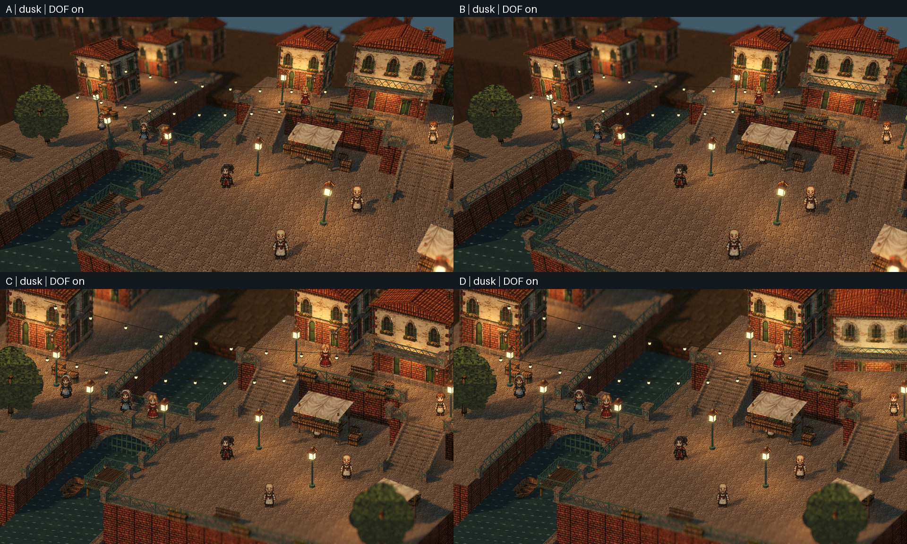
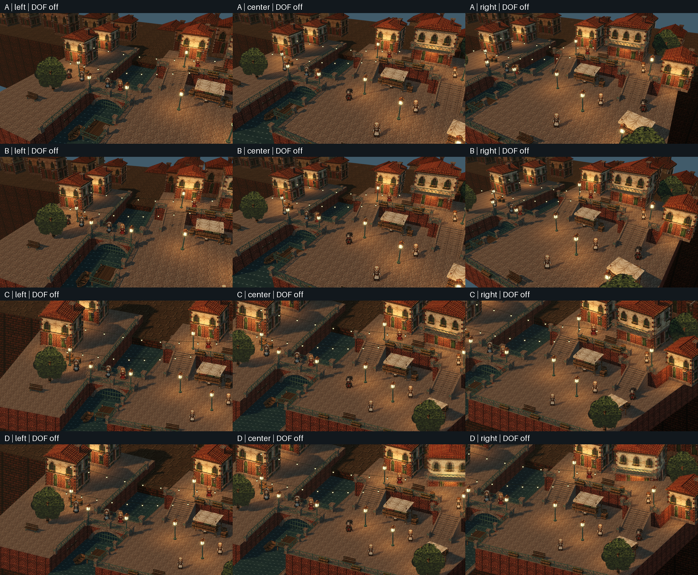
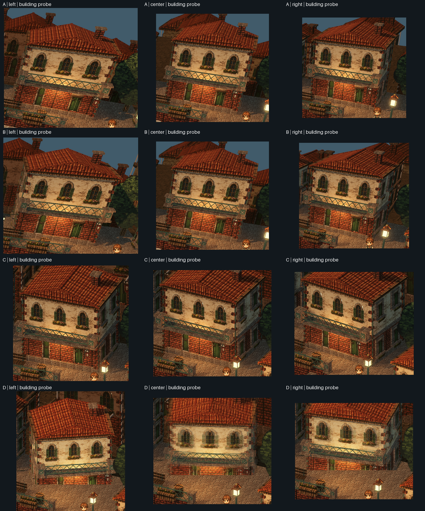
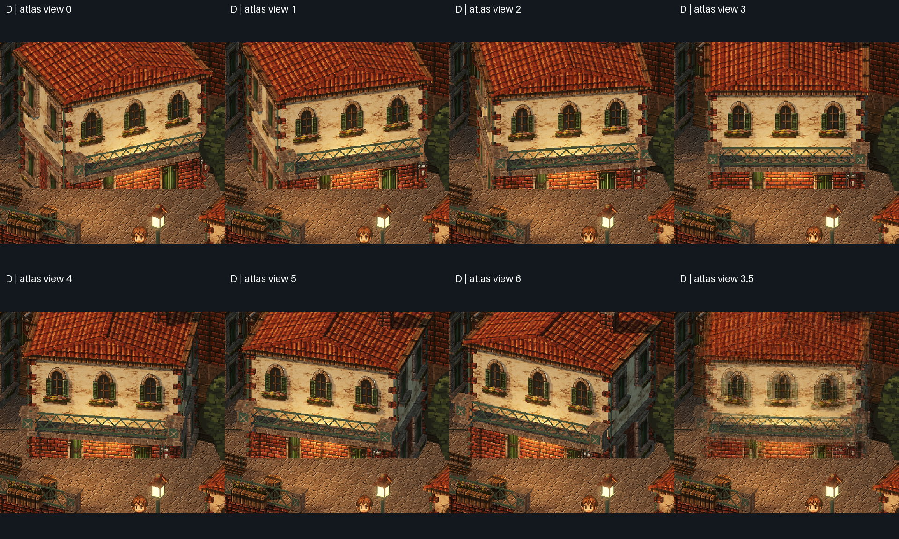
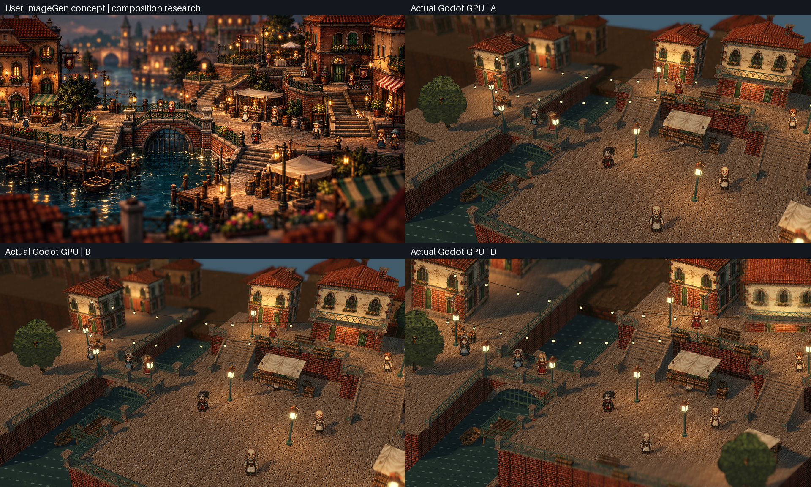

# P9 四方案集中审阅

从 `3b6333f` 接续。A/B/C/D 均已实现并保留在同一工程和独立 Linux 包；未提交、未推送。工程验收完成，视觉选择仍待用户审阅。这是原创模块化测试场景，不是原作美术定稿。

## 先看什么

交付目录中的 `four-way.mp4` 为四段同路线、同速度录像的同步四宫格。`A.mp4` 至 `D.mp4` 保留各自1080p画面。运行 `lantern-canal-four-experiments.x86_64` 后按 F9 切换；A 为默认入口。F6 景深、F8 视差，T 切时段，WASD／方向键行走，E 交互。共同路线可由 F9 面板启动，Esc 取消。

## 结论与推荐

推荐以 **A 为稳妥基线，B 为更强侧面变化的候选**。A 已能在横移中看见主建筑两侧，构图不额外绕转；B 保持同样素材并明显扩大观察角变化。B 的运动舒适度仍需要真人连续观看，自动测试不能替用户作主观判断。全部实现保留，不自动采用推荐。

| 方案 | 侧面可信度与构图 | 像素、遮挡和接缝 | 适用与缺陷 |
|---|---|---|---|
| A 固定透视 | 真实三维，横移已跨越主楼正面；构图最稳定 | 有自然缩放，几何遮挡／阴影完整 | 推荐基线；远近像素尺寸不一致 |
| B 透视＋绕转 | 真实两侧变化更明显，保持固定俯角／半径 | 与A相同模型／材质／碰撞；绕转时边缘移动更多 | 推荐视觉候选；舒适度需录像主观审阅 |
| C 正交＋绕转 | 保留平面画感；当前绝对观察角只改变同一侧墙宽度 | 真实三维遮挡；近远同样大小，场景压缩感更强 | 无法在当前±6°范围跨到另一侧；没有暗中加透视 |
| D 正交＋多视图 | 图集确实模拟左右侧面，层倍率可独立调节 | 相邻视图用不透明像素抖动；门窗／檐口出现网点和双边轮廓；单深度平面与地面有裁切、遮挡轮廓与物理体不一致，不投射主楼体积阴影 | 保留为2.5D实验，当前不推荐主场景；没有换成3D后继续叫D |

### 同一栋主楼的实际观察角

| 方案 | 左 | 中 | 右 |
|---|---:|---:|---:|
| A | -7.19° | +4.04° | +13.96° |
| B | -11.25° | +4.04° | +18.83° |
| C | +21.30° | +27.30° | +33.30° |
| D | -7.19° | +4.04° | +13.96° |

A/B 是主楼到相机的几何射线角；C 是正交观察方向；D 是模拟选图角。D 源图集覆盖±24°，当前指定路线只使用其中一部分，这是模型／路线的真实结果，不强行拉满七帧。C 当前约21°至33°，说明“正交＋小绕转”确有侧面宽度变化，但不等于看见另一侧。

左端游戏构图中主楼部分出画，故另做3840×1080宽视口检查。该检查不改变相机位置和观察方向，仅扩展横向视域；不能作为实际游戏构图或通行证据。保守建筑包围盒有垂直裁切标记，原始图和标记一起保留。以下裁切图用于确认同一模型侧墙变化。

D固定镜头的七帧和3.5过渡夹具，其计算脚点投影保持在同一建筑地面中心；这不消除贴片与世界的深度遮挡不一致，也不证明所有轮廓像素都不抖。C/D左端仍有树冠遮挡主角，应作为后续美术／遮挡处理的已知问题。

## 工程验收

| 项目 | 结果 |
|---|---|
| 原图与资产 | 两张用户PNG原字节归档；文件及RGBA像素散列；23张运行PNG从原图确定性生成，16套模型源／GLB保留 |
| 数学与状态 | 4603项通过；独立引擎投影检查、偏航规则、设置隔离、预览完整回位 |
| 四方案路线与状态 | 303项通过；各3354运动物理帧，零跌落恢复；两组台阶、码头与NPC交互通过 |
| 当前源码真实GPU | 403项通过；三观察点×三时段×DOF开关共72张场景截图，另4张F9面板与投影夹具 |
| P6景深 | A/B/C/D近／焦内／远棋盘都实测通过；正交不靠开关值推定支持 |
| P8像素标记 | 400个五层GPU标记测量，最大位移误差0.450px，阈值0.8px；B/C涵盖−6/0/+6°，倍率0/0.5/1/1.5/2 |
| 旧场景 | make test：410项P8及跨进程设置恢复通过；旧固定相机控制器未改；另有实际GPU回归证据 |
| 独立Linux | 仅二进制目录启动，headless及379项真实GPU检查通过 |
| 干净重建 | 从原PNG重做像素、Blender模型、离线图集、Godot导入及烘焙；379项GPU检查通过；未复用导入缓存 |
| 视频 | 四段1080p／30fps真实物理行走，同一路线、时段表、帧数与轨迹；同步四宫格不改变各方案速度 |

中央人物真实屏幕高度：111.888px，四方案相同；不是以世界竖直线段代替朝向镜头精灵。阴影保留原三维模型机制；D明确没有主楼体积投影阴影。P7天空与城市层三时段同步，背景地基补齐后仍可能在极端倍率或构图边缘露出层次关系，不能称为无缝商业定稿。

视差代表点精确不等于厚背景整层精确。B在偏航+6°、横移7m、总倍率2的极值，可见近城层多个mesh边界点相对各自理想屏幕位置的最大偏差为16.581px；A/C/D本次可见点采样低于0.001px。视锥外接近投影奇点的原始大误差也在完整JSON保留，不拿它代替画面内误差。这里没有放宽代表点0.8px的GPU验收条件，报告的是另一项明确的整层近似限制。

### 性能

NVIDIA GeForce RTX 4070 SUPER，Godot 4.7.2-stable (official)，forward_plus，1920×1080，关闭VSync。每方案每时段连续真实墙钟采样≥30秒；采样期间没有其他本任务GPU作业。12组最大帧间隔P95为2.865ms，GPU P95最大2.374ms，均低于16.667ms目标。

| 方案 | 时段 | 秒 | 帧间隔P95 ms | GPU P95 ms | 引擎显存 MiB |
|---|---|---:|---:|---:|---:|
| A | day | 30.00 | 2.865 | 2.374 | 330.7 |
| A | dusk | 30.01 | 2.681 | 2.312 | 330.7 |
| A | night | 30.00 | 2.629 | 2.299 | 330.7 |
| B | day | 30.00 | 2.799 | 2.366 | 330.7 |
| B | dusk | 30.01 | 2.638 | 2.308 | 330.7 |
| B | night | 30.01 | 2.752 | 2.325 | 330.7 |
| C | day | 30.00 | 2.568 | 2.176 | 330.7 |
| C | dusk | 30.01 | 2.575 | 2.181 | 330.7 |
| C | night | 30.00 | 2.688 | 2.316 | 330.7 |
| D | day | 30.00 | 2.552 | 2.149 | 330.7 |
| D | dusk | 30.01 | 2.602 | 2.215 | 330.7 |
| D | night | 30.00 | 2.557 | 2.211 | 330.7 |

帧间隔是渲染完成间隔，GPU时间来自视口测量，显存来自Godot rendering info；不是显示延迟或全系统显存。原始逐帧数组在证据JSON中。D只替换一栋楼，不应由这组结果推论整城贴片一定更快。

## 来源、美术与重建边界

本轮原图素材板文件SHA256为 `48db5064440c2a2562591ea42eaec7a485f02b272a29743afc08f02bea19d3a0`，与历史工具记录 `ff85aae1…` 不同。两个记录都保留；不宣称恢复了历史文件。延伸概念图SHA256为 `6a5a13bbf85e044b3670c71e9a9a9fb32863fb95b1275dbc4c8bbf83dcda94ad`。旧有损输入及派生产物在 `art_source/reference-scene/baseline-3b6333f` 保留对照。

素材生产是原图裁切、四点校正、连通去底、调色量化、像素化和atlas，不把概念整图当游戏场景。角色仍是有限姿态的派生行走帧，不是新生成的完整商业动画套件。建筑左右窗框、腰线、檐口和转角由同一模型管线补足；四方案共用，不为某方案单独提升美术。

当前桥闸、运河、双岸、高台、市场和码头关系具备，但桥体画面占比、拥挤市场密度、曲线楼梯和细碎立面仍弱于参考；布局较开阔，不能称为高还原完成。这里保留该差异供审阅，不以工程通过代替美术验收。原作截图只供本地研究，不提取纹理／角色，不打入运行包或分发源码。

用户原作截图与实际GPU的并排研究图单独放在审阅包 `reference-study.png`，不进入工程源码或运行资产。

干净重建的PNG字节一致；GPU图集另记录逐通道像素差异，见 `build/p9-experiments/rebuild-report.json`，不能将GPU跨设备输出承诺为字节级确定性。

## 证据索引

- `build/p9-experiments/gpu/report.json`：源码指纹、72张截图、相机状态、12组原始性能。
- `build/p9-experiments/gpu/experiment-image-report.json`：独立像素测量。
- `build/p9-experiments/headless/report.json`：四方案完整路线、碰撞不变、输入方向与停步收敛。
- `build/p9-experiments/media/video-report.json`：视频元数据、帧数、四条物理轨迹一致性与散列。
- `build/p9-experiments/layer-approximation.json`：厚背景层代表点以外的投影近似误差。
- `build/p9-experiments/standalone-gpu`、`rebuild-gpu`：独立包和干净重建截图／测量。
- `build/p9-experiments/delivery/SHA256SUMS`：最终交付校验和；完整工程、证据包、Linux包均可校验。

[执行日志](execution-log.md) · [复现流程](../../workflows/p9-four-experiments.md) · [机制与操作](../../design/reference-experiments.md) · [计划](../../../Plan/features/p9-four-experiments.md) · [ADR-19](../../../ADR/19-reference-camera-experiments.md)
