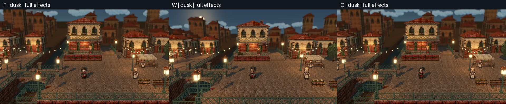
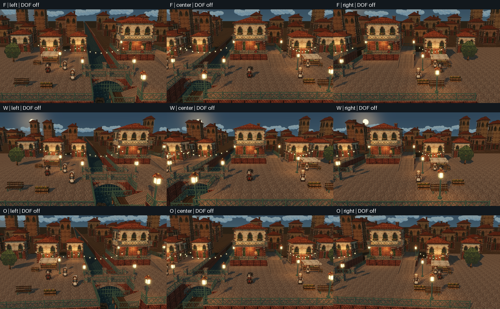
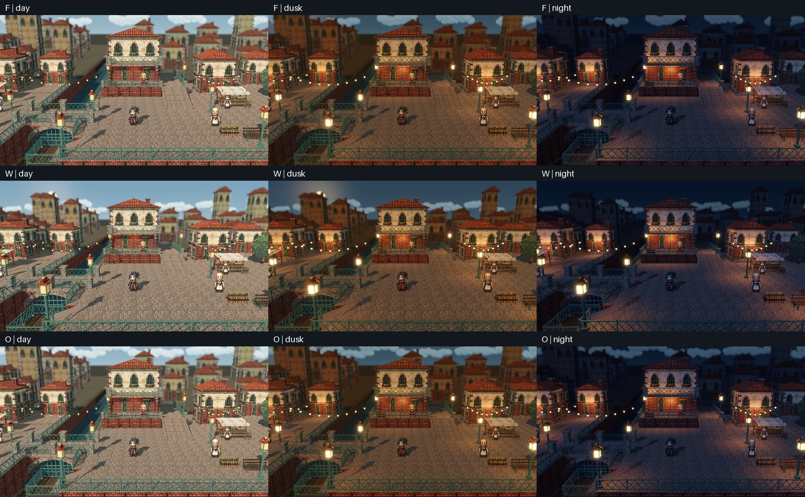
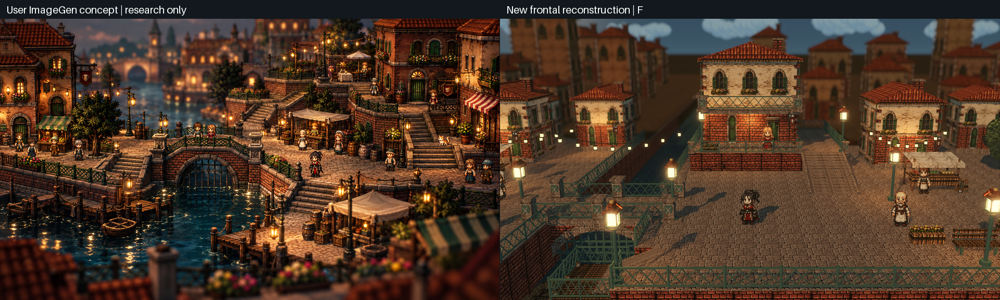

# P9R2 正面运河审阅

当前源码快捷键改为C相机、P视差、O景深，避免与编辑器F8停止/F9暂停冲突。下文与旧ZIP保留历史键位和证据。新操作及验收边界见[输入安全修复](../input-safety/README.md)。

本报告及图片保留原始审阅版本。之后新增镜头调节与纹理导入变化，当前提交状态另见[提交前校验](../p9-frontal-zoom/commit-check.md)。

旧四方案已提交为 `171e632`，没有推送。本轮另建正面运河场景，保留F/W/O三组镜头；新工作未自动提交。旧A/B/C/D和旧场景不修改。

## 打开与对比

解压 `frontal-canal-linux.zip` 后运行 `./frontal-canal.x86_64`。F9切换F/W/O、恢复本组默认值或运行共同路线。WASD/方向键行走，E交互，T切时段，F6景深，F8视差，Esc关闭面板或取消路线。

先看 `three-way.mp4`，三段同路线同步横向对照。`F.mp4`、`W.mp4`、`O.mp4`保留完整1080p画面。比较入口默认为F，不替用户选定最终方案。

## 实际改变

新场景取消旧镜头约27°的斜向观察，中央朝向正对主建筑。重排双岸、桥闸、高台、台阶、市场、码头和远景，不是给旧场景改一个相机标签。三组都是透视投影，没有正交镜头或建筑多视图贴片。

| 组 | 镜头 | 差别与审阅重点 |
|---|---|---|
| F 稳定正面 | 35°FOV，14°俯角，30m半径，朝向固定 | 平移就能真实换侧。构图较稳，作为新基线推荐 |
| W 较强纵深 | 45°FOV，12°俯角，23m半径，朝向固定 | 近远缩放和侧墙更明显，人物在中央比F稍大，边缘透视变化也更强 |
| O 轻微绕转 | F基础上增加±4°位置驱动偏航 | 侧面变化更强，中央与F相同，区别需要看行走段。运动舒适度仍需真人审阅 |

三组共享完整三维模型、材质和49个碰撞体。横向跟随默认0.7；偏航只属于O。靠左时相机跨到主楼左外墙之外，靠右时跨到右外墙之外，因此两面是真实几何露出，不是图片替换。道路、建筑和碰撞不跟随镜头移动。

| 组 | 左端观察角 | 中央观察角 | 右端观察角 |
|---|---:|---:|---:|
| F | -18.36° | -0.00° | +11.77° |
| W | -21.71° | -0.00° | +14.04° |
| O | -20.99° | -0.00° | +14.53° |

这些角度取真实物理路线停步后的主楼到相机射线。左右墙体投影均有至少1500px²可见面积且宽度至少16px，主楼完整轮廓另用GLB顶点检查；截图保持1920×1080原视域，没有扩宽视口补救。

## 验收结果

| 项目 | 结果 |
|---|---|
| 相机数学 | 2115项通过，全部透视，中央正面、低俯角、两侧模型完整在画面内、参数隔离与预览恢复 |
| 源素材 | 571项检查通过，两张ImageGen原图、处理配方、23张运行PNG和16套Blender源/GLB延续已提交生产链 |
| 实际路线 | 三组各25站，headless每组2253移动物理帧；30fps录制每组2256移动物理帧，三组录像轨迹误差为0。桥、楼梯、高台、码头及交互通过，零跌落恢复 |
| 状态/物理 | 131项通过，切换保留玩家/时段/景深，碰撞不变，输入方向和停步收敛正常 |
| 源码GPU | 362项通过，54张场景截图；原生近/远景深棋盘和焦内保护实测通过 |
| P7天空 | 三组各三时段配色同步，近远两层云均处于真实视锥和远裁切范围内 |
| P8视差 | 250个五层标记测量，最大绝对/位移质心误差0.488px，阈值0.8px。O覆盖−4/0/+4°，倍率0/0.5/1/1.5/2 |
| 旧场景 | make test通过，含410项P8及跨进程设置恢复；旧脚本和旧场景文件没有改动 |
| 独立包/干净副本 | 独立二进制启动验证；新world从布局重新烘焙，使用全新Godot导入缓存，原素材来源检查通过 |

P8只补偿横向平移引起的背景位移，O的绕转保持自然。每层代表点精确不代表厚背景所有顶点都能精确，极端倍率仍可能暴露分层关系。所有观察组均保留，不以自动化结果代替视觉批准。

### 性能

NVIDIA GeForce RTX 4070 SUPER，Godot 4.7.2-stable (official)，1080p Forward+，VSync关闭。每组每时段实际墙钟采样至少30秒。最大帧间隔P95 2.967ms，最大GPU P95 2.663ms。只代表本机，显存为引擎报告值。

| 组 | 时段 | 秒 | 帧间隔P95 ms | GPU P95 ms | 显存MiB |
|---|---|---:|---:|---:|---:|
| F | day | 30.01 | 2.741 | 2.412 | 302.7 |
| F | dusk | 30.00 | 2.801 | 2.409 | 302.7 |
| F | night | 30.00 | 2.918 | 2.453 | 302.7 |
| W | day | 30.01 | 2.795 | 2.395 | 302.7 |
| W | dusk | 30.00 | 2.967 | 2.663 | 302.7 |
| W | night | 30.00 | 2.799 | 2.400 | 302.7 |
| O | day | 30.01 | 2.773 | 2.415 | 302.7 |
| O | dusk | 30.00 | 2.956 | 2.464 | 302.7 |
| O | night | 30.00 | 2.768 | 2.410 | 302.7 |

## 仍需你审阅的地方

推荐先看F，再看O的换侧行走段；偏好明显纵深可以选W。三者都实现真实左右换侧，但美术还不能称为原作级还原。建筑模块重复、前方广场较规整、云层较卡通，灯具局部发白，市场密度和曲线台阶不及概念图。F/O中央画面本来就相同，不能用静态中央图判断绕转收益。

录像抽检发现O约21.5秒处前景路灯遮住主角大部分躯干，但头仍可见；F同处灯贴近主角，W更分开。码头栏杆会遮小腿。当前没有角色遮挡淡出系统，不宣称全程无遮挡；主楼两侧观察点的角色物理视线和实际截图已检查。像素密度随透视距离变化，这是本轮真实透视的代价。夜景更强调灯光，人物在无灯处较暗。详细抽检见 `video-review.md`。

## 来源和复现

没有新依赖、没有启用Blender MCP、没有使用概念整图当场景，也没有从原作截图提取纹理或角色。新场景复用已提交的原创模块及ImageGen派生纹理，所有.blend、.glb和生成脚本随完整工程保留。原图文件/像素散列与历史差异仍在原来源manifest，新场景另有 `art_source/frontal-canal/manifest.json`。

`frontal-complete-project.zip` 保留旧场景、旧四方案和新三组实现。新独立包默认进入新场景。原作研究截图不进入源码包和运行包，只在单独研究对照图里展示。

干净副本的新World与原World除了Godot自动生成的node unique_id以外，序列化文本逐字节一致；两个原始SHA不同，规范化检查另有SHA记录，没有宣称原文件字节一致。

命令入口：`make frontal-test`、`make frontal-visual`、`make frontal-record`、`make frontal-export`、`make frontal-rebuild`、`make frontal-package`。工程默认启动旧场景不变，使用 `make frontal-run` 进入新场景。详细过程见 `workflow.md` 与 `execution-log.md`。交付完整性见 `SHA256SUMS`。
