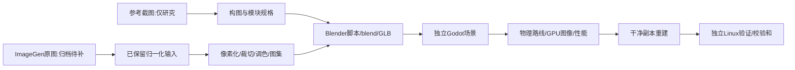

# P9 验收记录

状态：下列工程验收通过；上游 ImageGen 源图归档与最终视觉验收未通过。当前交付为工程预览。

## 本轮接续

基线提交 `0673236`。接手时已有未提交的 P9 场景、模型、素材及测试；本轮保留这些实现，增加可重复验收入口。

`python3 tools/p9/accept.py headless` 检查实际物理路线和控制器。
`python3 tools/p9/accept.py gpu` 运行实际 GPU 截图、图像检查和持续性能采样。
`python3 tools/p9/accept.py rebuild` 从独立临时副本重新生成像素资产、Blender 模型与烘焙场景，并进行 GPU 检查。
`python3 tools/p9/accept.py export` 在独立副本中选择新场景为入口，导出 Linux 程序，并从只有可执行文件的目录测试。
默认旧场景入口保持不变。

## 素材来源限制

项目中的 `approved-intake.webp` 是 384×256 有损归一化输入。它可以支持离线重建，但不是原始 ImageGen 源图归档。
已记录的上游素材板 SHA256 为 `ff85aae1ce6b117ad597bc5932a4a2f01eacbc61140df3a2860fd1a59ba138ed`。
当前会话工具未返回该原图或延伸概念图；本机生成图目录也未找到与该散列一致的文件。
因此“ImageGen 原图归档”保持未通过，不能以缩小素材板或重新生成图冒充原图。
原作参考截图仅作结构研究，不能作为发布贴图。

## 验收边界

自动通行使用 CharacterBody3D 实际运动，并检查没有触发跌落回位。截图定位可以传送，但不作为通行证据。
干净重建验证从已保留的归一化输入重做资产，不验证在线生成服务再次输出相同图像。
实际画面仍存在重复建筑、贴图密度和远景衔接等美术限制，截图成功不代表用户视觉验收。

证据位于 `build/p9/`。不引用 P8 性能数字代替 P9。

## 当前源码 GPU 与性能

当前源码 207 项 GPU 检查、38 项景深图像和71项视差图像检查全部通过。`build/p9/gpu/report.json` 包含运行资源指纹、截图散列和完整逐帧样本。
条件为 RTX 4070 SUPER、Godot 4.7.2 Forward+、1920×1080、关闭VSync，每组真实墙钟采样至少30秒。最终采样与本轮其它GPU测试串行执行。

| 条件 | 帧间隔 P95 ms | GPU P95 ms |
|---|---:|---:|
| 背景关、景深关 | 1.823 | 1.608 |
| 背景开、景深关 | 1.758 | 1.667 |
| 标准景深 | 2.291 | 2.184 |
| 强景深 | 2.499 | 2.189 |
| 黄昏柔和视差 | 2.407 | 2.130 |
| 黄昏增强视差 | 2.306 | 2.176 |
| 夜晚 | 2.525 | 2.205 |

七组均通过16.667ms预算。这是固定场景的引擎视口计时，不是输入延迟，也不代表其它显卡。
早期 `gpu-full` 采样与部分其它验证重叠，只保留作执行记录；以上使用最终 `gpu` 结果。

## 已完成的独立验证

| 项目 | 结果 | 证据 |
|---|---|---|
| 原项目回归 | make test 通过，410 项 P8 功能及跨进程设置保存恢复通过 | build/p8/headless、build/p8/settings |
| P9 独立包无图形路线与参数 | 151 项通过 | build/p9/standalone-headless/report.json |
| P9 独立包实际 GPU | 193 项通过 | build/p9/standalone-gpu/report.json |
| 独立包图像 | 景深 38 项、视差 71 项通过 | 同目录 dof-image-report.json、image-report.json |
| 干净副本 | 归一化输入像素输出一致；16 套 Blender 模块重新生成、导入、烘焙通过 | build/p9/rebuild-report.json |
| 重建后实际 GPU | 193 项及 38+71 项图像检查通过 | build/p9/rebuild-gpu |
| 实际行走录像 | 1280×720、30 FPS、1002 帧、33.4 秒；过桥、左右往返、上层台阶和三时段 | build/p9/walkthrough.mp4 |

首次重建检查因缺少三时段视差截图矩阵失败；已补充采集后重跑通过。首次独立包检查因模板禁止命令行场景覆盖失败；已改为在导出副本设置默认场景后重跑通过。没有删除相应图像或功能断言。

## 视觉对照结论

两者都有纵向水道、桥闸、左右两岸、右侧上层平台、楼梯和市场。当前原创场景的桥较小，画面更开阔，建筑壳体重复明显，远景城市边缘仍能看到空隙；原参考的桥前景比重、曲线台阶、复杂立面和拥挤市场密度尚未达到。
人物和 NPC 来自归一化素材，动画沿用有限派生姿态，不能称为完整生成角色动画。
因此当前可交付为工程预览，不能称为高还原美术定稿。

## 使用

工程运行 `make p9-run`；独立运行 `build/p9/linux/lantern-canal.x86_64`。
WASD/方向键移动，E 对话/调查，T 切换时段，F6 景深面板，F8 视差面板，Tab 隐藏界面。
从出生点向桥面走，左右穿越两岸；两组主楼梯连接上层，水边小楼梯连接码头。
`make p9-test`、`make p9-visual`、`make p9-rebuild`、`make p9-export`、`make p9-package` 分别提供验证和交付入口。

## 仍需完成

1. 重新取得并归档原始模块化城镇资产板和延伸运河城镇概念图，核验已有散列并把原图到归一化输入的处理变为可执行配方。
2. 根据原图与当前 GPU 截图继续校准桥体占比、建筑密度和远景衔接；用户视觉 review 尚未进行。
3. 当前包保留明确的工程预览状态；不得将上述缺口勾选为完成。

## 生产与验收流程

