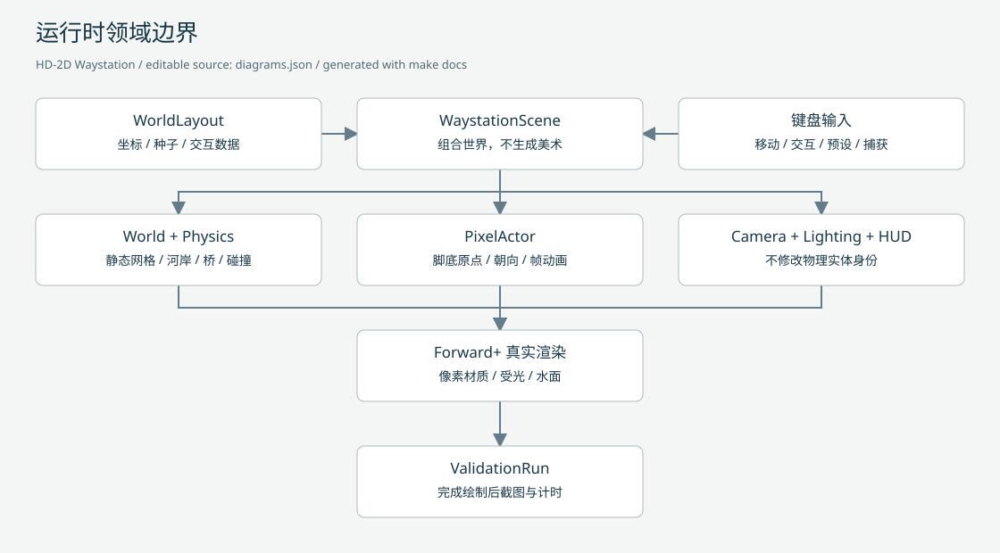
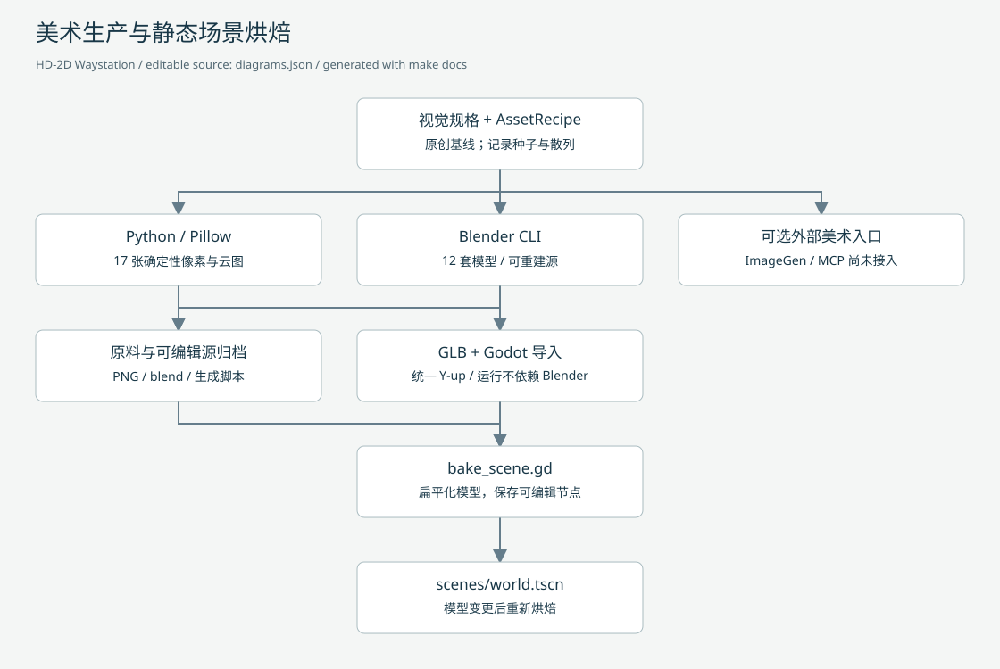
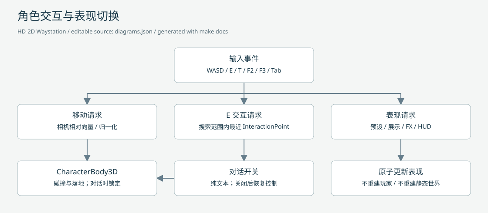
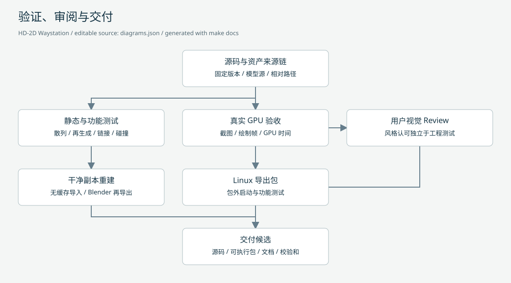
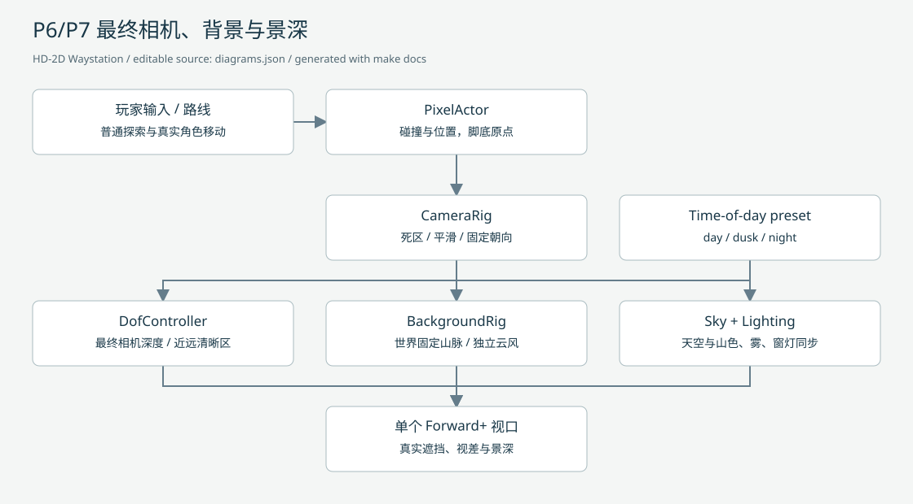
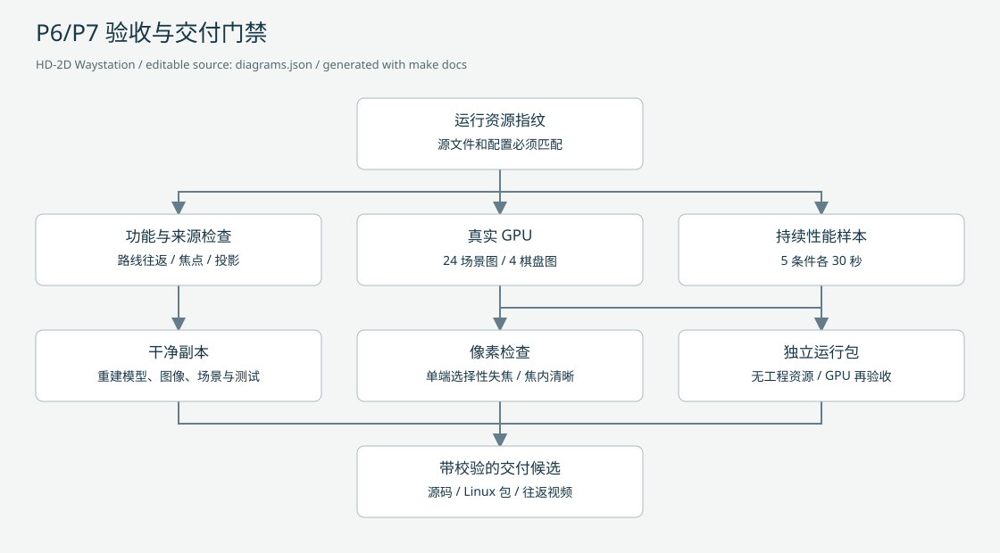

# 流程图与维护入口

`diagrams.json` 是单一图结构源，节点包含标题、职责与布局坐标。`make docs` 使用项目内 Python 标准库工具同时生成 `.mmd` 与 `.svg`，无 npm、浏览器或 Graphviz 安装依赖。修改源后再生成，不直接修改派生产物。

## 运行时领域边界

[Mermaid 源码](runtime.mmd)

## 素材生产与场景烘焙

[Mermaid 源码](assets.mmd)
ImageGen/MCP 明确标记为未接入的可选入口；图中实线表示设计关系，不表示第三方服务已经执行。

## 角色、交互与表现切换

[Mermaid 源码](interaction.mmd)

## 验证与交付

[Mermaid 源码](delivery.mmd)
交付候选可在工程验收通过后提供；最终视觉批准仍须用户确认，不因截图/性能自动测试通过而跳过。

领域术语以 [domain-model](../../domain-model/README.md) 为准，架构决定见 [ADR](../../ADR/README.md)。

## P6/P7 扩展

[Mermaid 源码](background-focus.mmd)

[Mermaid 源码](feature-validation.mmd)
