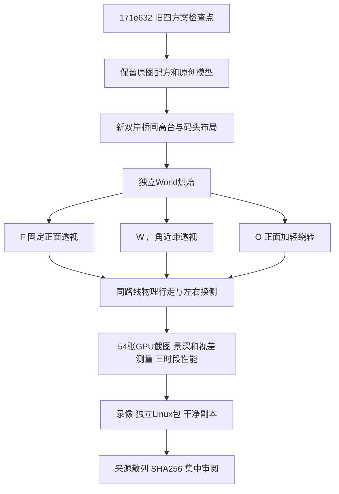

# P9R2 正面重建复现

工程已有工具即可运行，不安装依赖。Godot使用现有Forward+，Blender源模型沿用P9已验证生产链，Blender MCP不参与。

## 顺序

1. `make frontal-import` 导入，`make frontal-bake` 从 `resources/frontal-canal/layout.json` 重新生成World。
2. `make frontal-test` 验证素材来源、2115项相机数学和25站物理路线。
3. `make test` 回归旧场景及P8设置。
4. `make frontal-quick` 做真实GPU快速检查；`make frontal-visual` 增加三组各三时段30秒性能采样。主验收也可加 `--frontal-no-route`，此时必须另保留完整物理路线录像，报告明确标记跳过。
5. `make frontal-record` 在隔离工程中把MovieWriter窗口设置为1920×1080，录制F/W/O。物理速度固定3.2m/s；走到主楼梯顶切晴昼，码头招牌处切夜晚，其余起始黄昏。三联视频缩放拼接，不变速。
6. `make frontal-export` 在隔离工程中将默认入口改为新场景，导出Linux，复制到仅含二进制的目录后执行headless和实际GPU检查。源工程默认入口仍为旧场景。
7. `make frontal-rebuild` 用完整源文件复制建立无导入缓存的工程，删除该副本里的新World，重新从布局烘焙，检查素材来源，再执行物理/GPU检查。旧PNG/Blender生产链的完整再生证据保存在检查点171e632，本轮不宣称再次再生旧资产。
8. `make frontal-package` 仅在上述验收报告、源码指纹、视频检查全部通过后产生完整工程、独立包、证据和校验和。

## 目录

- `scripts/frontal_canal/`：独立世界组合、相机、灯光、城市背景、F9面板与P8扩展。
- `resources/frontal-canal/layout.json`：空间、交互、观察锚点、25站路线。
- `tests/p9frontal/`：数学、物理、GPU夹具；机制测量与艺术验收分开。
- `tools/p9frontal/`：烘焙、快速观察、跨进程设置/界面探针、录像和打包。
- `build/p9-frontal/`：本机生成证据和构建日志，不提交日志。
- `art_source/frontal-canal/manifest.json`：复用素材与新场景生产来源。

## 相机与状态

F/W/O均为真实三维透视。F/O中央35°FOV、14°俯角、半径30m；W为45°、12°、23m。O横向死区1m，12m后达到4°偏航，平滑2.5/s。横向跟随默认0.7，不改变物理世界。

F8只调整背景装饰层，绕转不被补偿。代表点通过同朝向虚拟相机扣除横向平移来计算精确屏幕补偿。远景有厚度，因此同层其他点保留投影近似误差，极端倍率不保证所有边缘完全无缝。

每组独立偏好路径。切换保留玩家位置、时段、景深，重建相机平滑状态。预览和路线结束恢复内部姿态与时钟状态。自动路线只在开始重置出生点、结束恢复用户状态；途中的每一站都由实际碰撞行走抵达。

## 安全与版权

无新依赖、无网络运行需要、不启用Blender MCP、不推送。原作截图只作研究；素材板进入可重复的裁切/校正/去底/调色/像素化/图集流程，概念图只用于构图对照。新结果原先保留为未提交工作；用户随后明确要求本地提交现有结果，当前验证与历史交付边界见[提交前校验](../validation/p9-frontal-zoom/commit-check.md)。
